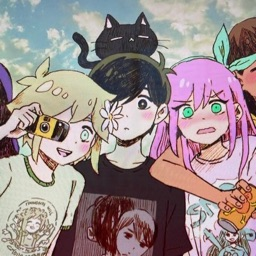

---
hide:
  - navigation
  - toc
---

{ class="gravitar-img" align=left }

## ShwampBam  
**Head Translator of the Isla Execution Squad**

The Isla Execution Squad was initially formed in 2020 to create an English patch for the Plastic Memories Visual Novel on PS Vita. Once that project finished in late 2022, we moved on to scanlating various manga that interested us. I ended up with free time between translating chapters and collabed with our proofreader Aidan to put out our first novel translation! Shaggy also graciously jumped on board to help with all kinds of image editing and compilation details. Hopefully, I'll be able to update this in the future to include more stuff we've done!  

**Let's you and I pray together that this website doesn't turn into a graveyard of unfinished content and unfulfilled dreams.**

  
  
  
    

---

{ class="gravitar-img" align=left }

## HoodedTissue
**Placeholder title subject to change**

 

  

---

{ class="gravitar-img" align=left }

## Shaggy
**Certified goat (According to general-chat)**

I joined February 2022 when the PlaMemo project stared gaining momentum because ShwampBam cold DMed me to help with video subtitles. To be honest, I didn’t really know what I was doing at first, but I ended up working on the game's assets. Not just the video subs. That led me to learn Photoshop, how the game displays its textures, and how to modify the texture map, along with various other aspecets of the game.

My background is in electronics repair, and at the time, it was a dream of mine to work on a game translation project, especially since Mother 3 is one of my all-time favorite games, and I could only play it because of its fan translation. I had no idea how I could contribute without knowing Japanese or understanding hoe to create game mods, but working within IES encouraged me to learn the skills necessary to make our projects more than text on a screen. Because of that, I’ve had the opportunity to work on more than just PlaMemo, I got work on scanlation projects, novel project(s), and even this website!

I’ve even branched out into non-IES projects. Such as a full translation and improvement patch for Verdia of the Resurection, [check it out](https://github.com/YunyunsFriends/Konosuba-Verdia-EN-Full)! Please, I somehow spent a year on this. There are others projects I'll be yapping about on Bluesky whenever they get released. Thank you for taking the time to check out our website and reading our about us section!

  
  

---

{ class="gravitar-img" align=left }
## ShadeSlayer
**You know the rules and so do I (do I)**

Shade, gimme Gravatar.

  

